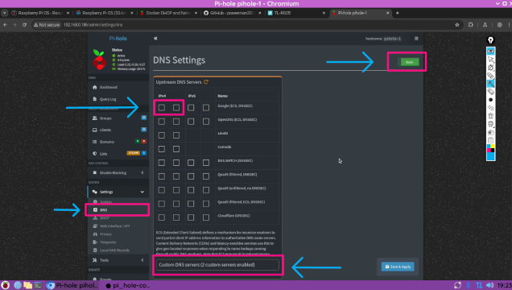
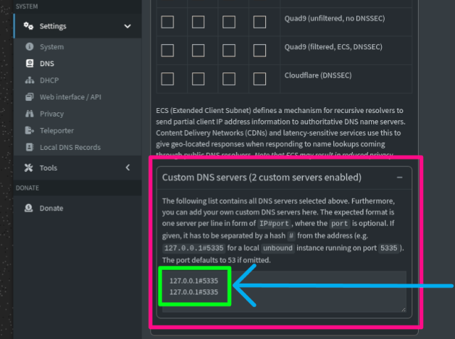

# Pi-hole + Unbound on Raspberry Pi Zero (Docker Compose)

This project sets up a **privacy-first recursive DNS server** using [Pi-hole](https://pi-hole.net) and [Unbound](https://nlnetlabs.nl/projects/unbound/about/) on a **Raspberry Pi Zero (ARMv6/32-bit)**. It uses Docker Compose for easy deployment.

---

## Reference Links:
- [madnuttah/unbound](https://hub.docker.com/r/madnuttah/unbound/tags)
- [mvance/unbound-rpi](https://hub.docker.com/r/mvance/unbound-rpi/tags)
- [raspberrypi-os](https://www.raspberrypi.com/documentation/)
- [docker/engine/raspberry](https://docs.docker.com/engine/install/raspberry-pi-os/)
- [nano-editor](https://nano-editor.org/)

---

## Features

- **Recursive DNS via Unbound**
- **Network-wide ad blocking with Pi-hole**
- **Lightweight Dockerized setup**
- **Optimized for Raspberry Pi Zero (32-bit)**

---

## ⚙️ Setup Instructions

### 1. Create project directories and configuration files

```bash
mkdir -p ~/pihole-unbound/unbound
cd ~/pihole-unbound/unbound
nano unbound.conf  # Paste config from below
```

### 2. Paste the following into ```~/pihole-unbound/unbound/unbound.conf```:

```bash
server:
  verbosity: 1
  interface: 127.0.0.1
  port: 5335
  do-ip4: yes
  do-udp: yes
  do-tcp: yes
  access-control: 127.0.0.0/8 allow
  root-hints: "/etc/unbound/root.hints"
  harden-glue: yes
  harden-dnssec-stripped: yes
  cache-min-ttl: 3600
  cache-max-ttl: 86400
```

### 3. Move up one directory ```~/pihole-unbound``` and create the ```docker-compose.yaml``` file

```bash
cd ~/pihole-unbound
nano docker-compose.yaml  # Paste config from below
```

### 4. Paste the following into ```~/pihole-unbound/docker-compose.yaml```:

```yaml
services:
  unbound:
    image: madnuttah/unbound:latest
    container_name: unbound
    volumes:
      - './unbound:/etc/unbound'
    restart: unless-stopped
    network_mode: host

  pihole:
    image: pihole/pihole:latest
    container_name: pihole
    depends_on:
      - unbound
    environment:
      # Set the appropriate timezone for your location (https://en.wikipedia.org/wiki/List_of_tz_database_time_zones), e.g:
      TZ: 'America/New_York'
      # Set a password to access the web interface. Not setting one will result in a random password being assigned
      FTLCONF_webserver_api_password: 'correct horse battery staple'
      DNS1: 127.0.0.1#5335
      DNS2: 127.0.0.1#5335
    volumes:
      - './etc-pihole:/etc/pihole'
      - './etc-dnsmasq.d:/etc/dnsmasq.d'
    cap_add:
      - NET_ADMIN
    restart: unless-stopped
    network_mode: host

```

## Example of a Default ```docker-compose.yaml``` from [docker-pi-hole](https://github.com/pi-hole/docker-pi-hole/#running-pi-hole-docker)

```yaml
# More info at https://github.com/pi-hole/docker-pi-hole/ and https://docs.pi-hole.net/
services:
  pihole:
    container_name: pihole
    image: pihole/pihole:latest
    ports:
      # DNS Ports
      - "53:53/tcp"
      - "53:53/udp"
      # Default HTTP Port
      - "80:80/tcp"
      # Default HTTPs Port. FTL will generate a self-signed certificate
      - "443:443/tcp"
      # Uncomment the line below if you are using Pi-hole as your DHCP server
      #- "67:67/udp"
      # Uncomment the line below if you are using Pi-hole as your NTP server
      #- "123:123/udp"
    environment:
      # Set the appropriate timezone for your location (https://en.wikipedia.org/wiki/List_of_tz_database_time_zones), e.g:
      TZ: 'Europe/London'
      # Set a password to access the web interface. Not setting one will result in a random password being assigned
      FTLCONF_webserver_api_password: 'correct horse battery staple'
      # If using Docker's default `bridge` network setting the dns listening mode should be set to 'all'
      FTLCONF_dns_listeningMode: 'all'
    # Volumes store your data between container upgrades
    volumes:
      # For persisting Pi-hole's databases and common configuration file
      - './etc-pihole:/etc/pihole'
      # Uncomment the below if you have custom dnsmasq config files that you want to persist. Not needed for most starting fresh with Pi-hole v6. If you're upgrading from v5 you and have used this directory before, you should keep it enabled for the first v6 container start to allow for a complete migration. It can be removed afterwards. Needs environment variable FTLCONF_misc_etc_dnsmasq_d: 'true'
      #- './etc-dnsmasq.d:/etc/dnsmasq.d'
    cap_add:
      # See https://github.com/pi-hole/docker-pi-hole#note-on-capabilities
      # Required if you are using Pi-hole as your DHCP server, else not needed
      - NET_ADMIN
      # Required if you are using Pi-hole as your NTP client to be able to set the host's system time
      - SYS_TIME
      # Optional, if Pi-hole should get some more processing time
      - SYS_NICE
    restart: unless-stopped
```

### 5. Download the root hints file:

```bash
curl -o ./unbound/root.hints https://www.internic.net/domain/named.root
```

### 6. Start the Containers:

```bash
docker compose up -d
```

### 7. Access the Pi-hole Admin Panel:

 - Visit: ```http://<your-pi-zero-ip>/admin```
 - Login with your ```FTLCONF_webserver_api_password```

### 8. Final Configuration Steps:

 - Go to Settings → DNS in the Pi-hole admin panel
 - Verify that only ```127.0.0.1#5335``` is set as the upstream DNS

<p align="center">
  
</p>

 - If not added during the intail setup, scroll down and add, and unselct the Google Default

<p align="center">
  
</p>

 - On your client device (PC, phone, router), set your Pi Zero’s IP as the DNS server

---

## Good Sites to Test Pi-hole Blocking:

| Website                     | What You'll See Without Pi-hole        | What to Look For         |
|-----------------------------|----------------------------------------|--------------------------|
| https://www.yahoo.com       | Tons of banner and sidebar ads         | Ads disappear            |
| https://www.cnn.com         | Inline ads between articles            | Blank spots              |
| https://www.speedtest.net   | Sponsored banners, popups              | Clean test page          |
| https://forbes.com          | Adblock wall, video autoplay           | Blocked elements         |
| https://www.tmz.com         | Popups, autoplay videos                | Smoother load            |
| https://www.dailymail.co.uk | Wall-to-wall ads                       | Much cleaner             |
| https://www.theverge.com    | Tech content with trackers & analytics | Reduced requests         |

---

## You should get a response — confirming your recursive DNS is working!

### Optional: Next Steps:

 - Add a second Pi-hole server for redundancy
 - Block telemetry and tracking domains more aggressively
 - Set up HTTPS access using a reverse proxy
